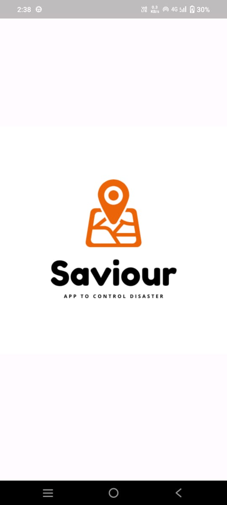
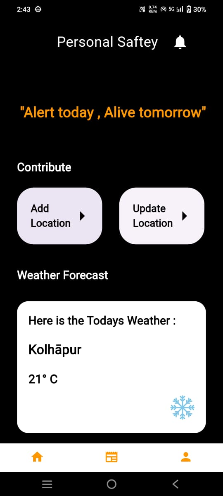
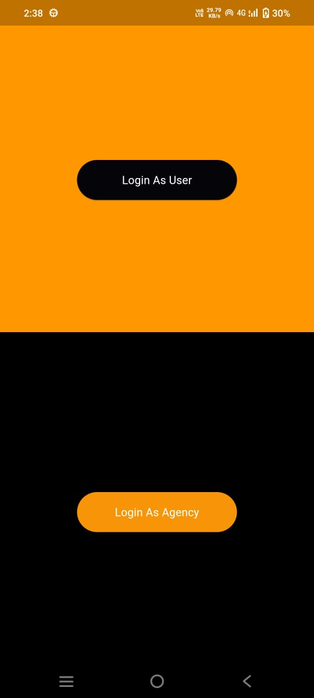
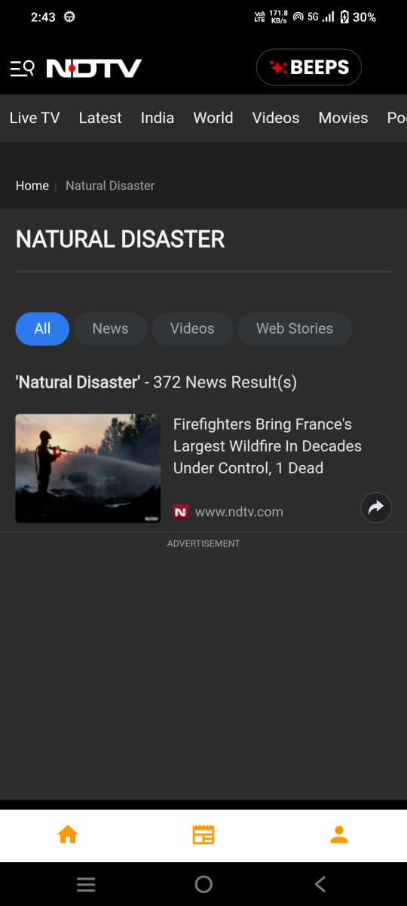

# Disaster Management Flutter Application

This is a Flutter-based mobile application designed to assist in disaster management. The app provides features for both users and agencies to manage and respond to disasters effectively.

## Features

### For Users:
- **Disaster News**: Stay updated with the latest disaster-related news.
- **Feedback Form**: Provide feedback or report issues.
- **User Profile**: Manage your personal information.

### For Agencies:
- **Login and Registration**: Secure access for agencies.
- **Disaster News Management**: Publish and manage disaster-related news.
- **Medical Information**: Access and manage medical resources.
- **Send Alerts**: Notify users about emergencies.

## Screenshots

Below are some images from the application:

### User Interface

#### Splash Screen


#### User Home Page


#### Agency Login


#### Disaster News


## Getting Started

### Prerequisites
- Flutter SDK (>=3.2.6 <4.0.0)
- Dart SDK
- Firebase setup for Android and iOS

### Installation
1. Clone the repository:
   ```bash
   git clone https://github.com/adeshingale3/disaster-management-flutter-application.git